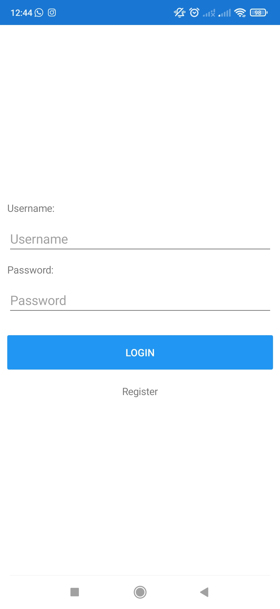
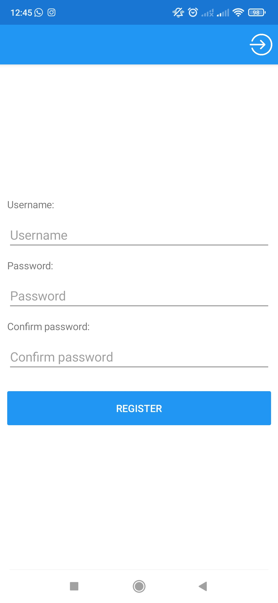
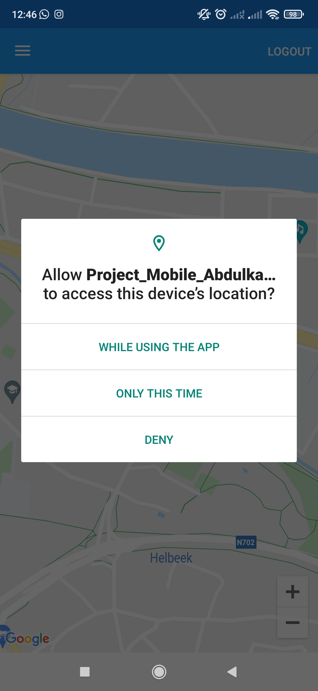
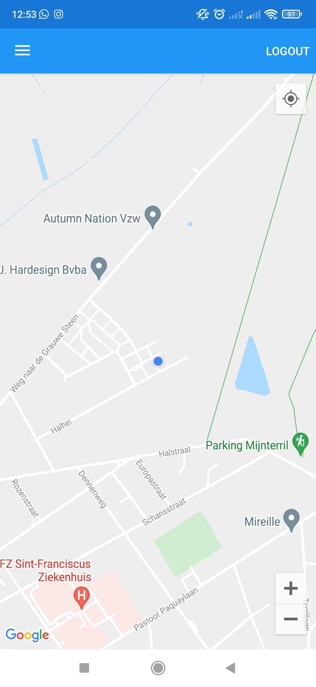
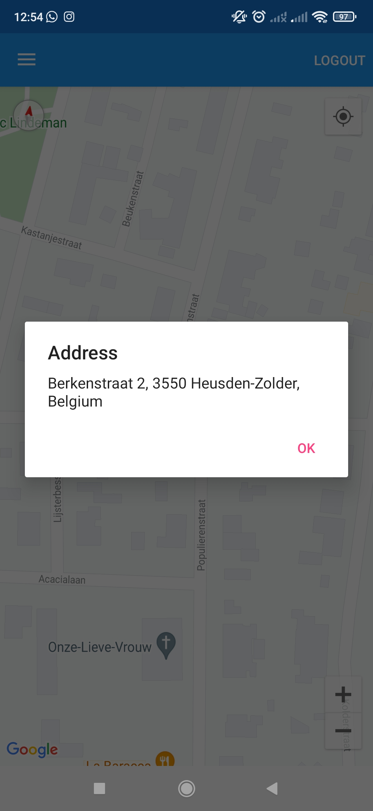
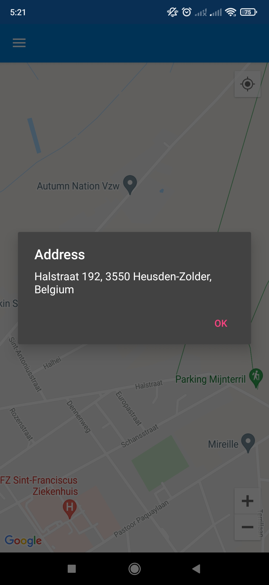
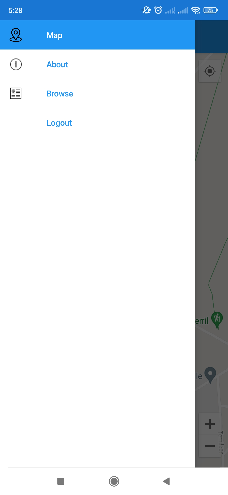

# Project C# Mobile 2021-2022
* Naam: *Abdulkadir Aksu*
* Onderwerp: *Animaltracker*
## Korte uitleg doel applicatie (uiteindelijk aangevuld met screenshots)

**Idee:**
Een tracking app maken voor burgers met last van dieren vooral wilde everzwijnen in hun buurt zodat de burgers kunnen ingeven dat op die locatie wilde dieren aanwezig zijn.

## **Doel:**
Doel is om de mensen die last hebben van wilde dieren in hun buurt geruststellen en op waak kunnen houden indien er wilde dieren aanwezig zijn. Hierdoor kunnen fietsers en joggers ook kiezen om sommige buurten te vermijden. 

     
     
    
     
     
     
    

## Logboek
<h4> Week van 15-21 November </h4>
 * Gebruik gemaakt van de fly-out versie + research over appshell/default gegevens.
 * Research over API's + permissions.
 * Problemen bij debuggen omwille van een lange path, project langs mijn C schijf zetten.
 * New master branch aangemaakt in mijn github repo.
 * Toevoegen van de maps page + permissions.
<h4> Week van 22-28 November </h4>
 * Registration page aangemaakt.
 * Simpel login & registration fly out geregeld bij startup van de app.
 * Content enkel visible na het inloggen mogelijk gemaakt.
 * Permissions asked enkel na het inloggen.
<h4> Week van 29-05 November-December </h4>
 * Met Xamarin Essentials ervoor gezorgd dat de app weet dat je ingelogt bent ook al sluit je de app.
 * Research over integration van FireBase.
<h4> Week van 10-16 Januari </h4>
 * Login en Registration connected met Firebase rldb.
 * User kan wachtwoord veranderen connected met firebase db op settingspage.
 * User kan account verwijderen connected met firenase db op settingspage.
 * Git push,pull problemen, mislukt aantal keren push en commits, merge conflicts, solution file is oud terwijl de rest van de folders up to date zijn.
 * Eigen repo aangemaakt https://github.com/AbdulkadirAksu28/MobileProject.
<h4> Week van 17-23 Januari </h4>
 * Veranderen van alle namespaces.
 * Toevoegen van een custom map renderer en de daarbij horende models.
 * Toevoegen van styles.
 * Toevoegen van verschillende dieren.
 * Mogelijk maken om extra dieren toe te voegen.
 * Converter NullToVisibility toegevoegd, Behaviour bug issues gefixed.
 * Searchbar added.
 * Code cleaning.

## Bronnen
  https://github.com/jfversluis 
  https://www.youtube.com/channel/UCBBZ2kXWmd8eXlHg2wEaClw
  https://www.c-sharpcorner.com/article/xamarin-forms-login-forms-with-firebase-real-time-database-mvvm/
  https://docs.microsoft.com/en-gb/xamarin/
  https://stackoverflow.com/
  https://social.msdn.microsoft.com/
  http://gjhdigital.com/xamarin/xamarin-forms-maps-add-custom-pin-icon-with-click-event/
  https://github.com/ziyasal/FireSharp/
  https://github.com/xamarin/xamarin-forms-samples
  https://icons8.com/icons
  https://www.iconfinder.com/
  https://www.flaticon.com/

## Video
https://web.microsoftstream.com/video/d2617d65-9493-4a57-a94f-689eda7e76e6

